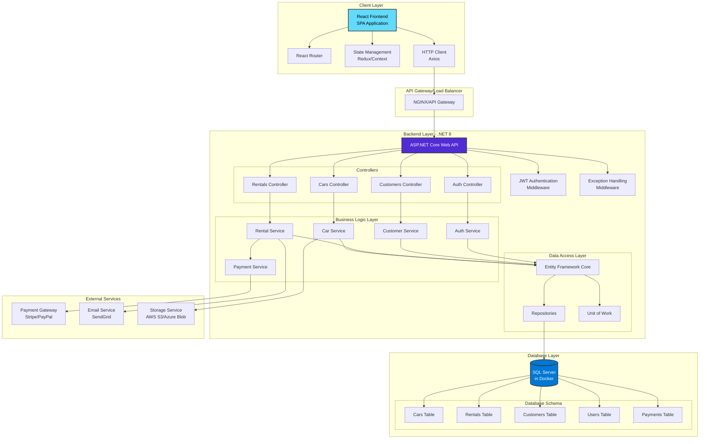
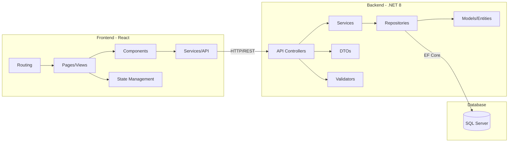
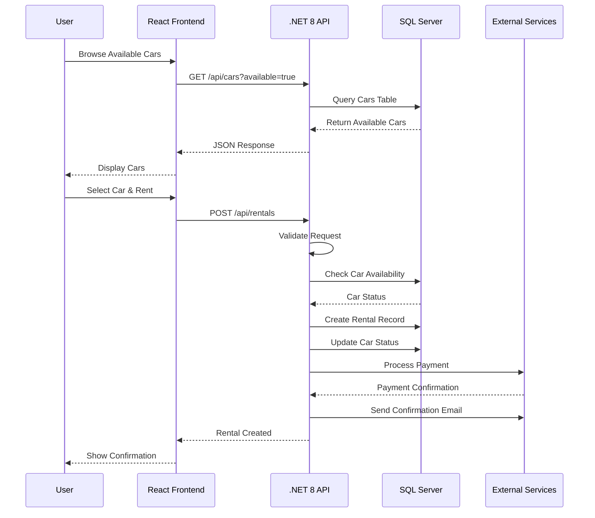
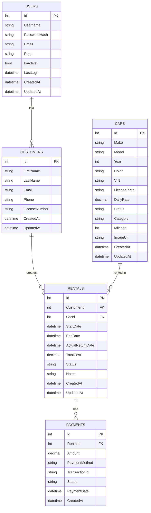
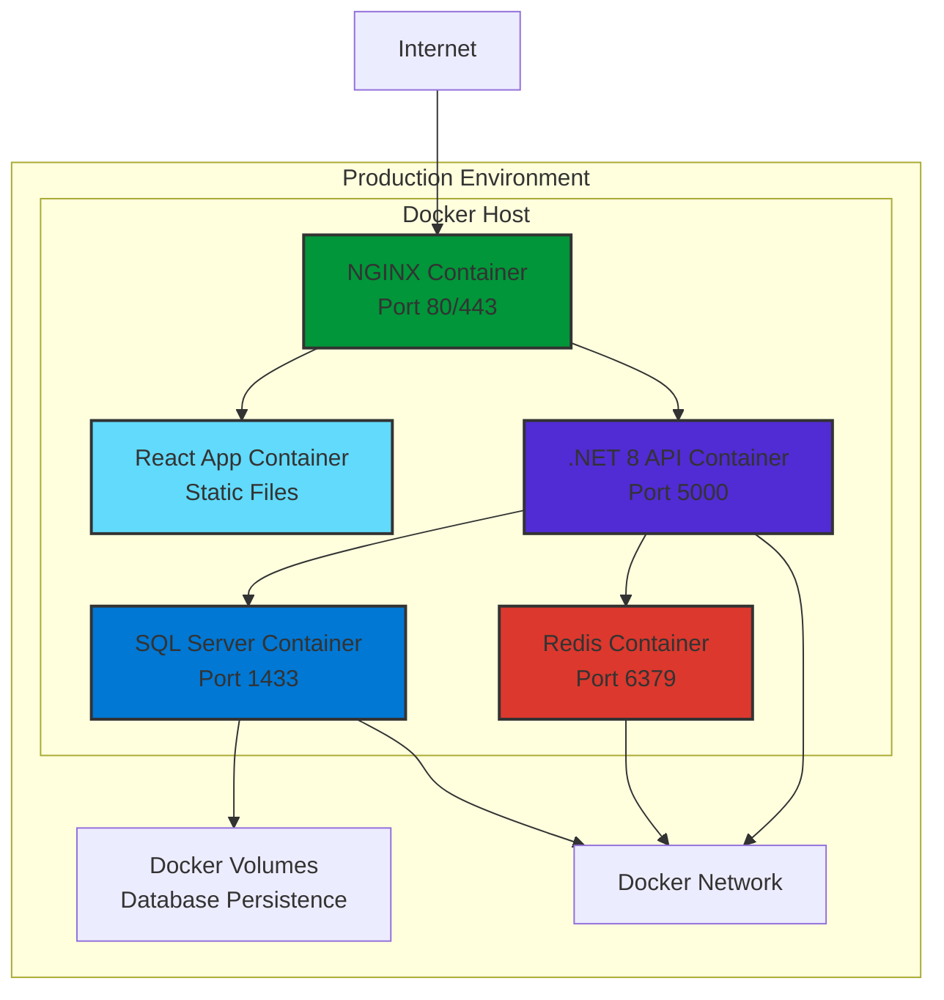

# Car Rental App - Architecture Design

## System Architecture Overview

This document outlines the architecture for the Car Rental Application using .NET 8, SQL Server (Docker), and React.

## Architecture Diagram



## Component Architecture



## Data Flow Diagram



## Database Schema



## Technology Stack

### Frontend

- **Framework**: React 18+
- **State Management**: Redux Toolkit / React Context
- **Routing**: React Router v6
- **HTTP Client**: Axios
- **UI Components**: Material-UI / Ant Design
- **Form Handling**: React Hook Form
- **Validation**: Yup / Zod
- **Build Tool**: Vite / Create React App

### Backend

- **Framework**: ASP.NET Core 8 Web API
- **ORM**: Entity Framework Core 8
- **Authentication**: JWT Bearer Tokens
- **Validation**: FluentValidation
- **API Documentation**: Swagger/OpenAPI
- **Logging**: Serilog
- **Caching**: Redis (optional)

### Database

- **Database**: SQL Server 2022
- **Container**: Docker
- **Migrations**: EF Core Migrations

### DevOps

- **Containerization**: Docker & Docker Compose
- **Version Control**: Git
- **CI/CD**: GitHub Actions / Azure DevOps

## Deployment Architecture



## API Endpoints Structure

### Authentication

- `POST /api/auth/register` - Register new user
- `POST /api/auth/login` - Login user
- `POST /api/auth/refresh` - Refresh token
- `POST /api/auth/logout` - Logout user

### Cars

- `GET /api/cars` - Get all cars (with filters)
- `GET /api/cars/{id}` - Get car by ID
- `POST /api/cars` - Create new car (Admin)
- `PUT /api/cars/{id}` - Update car (Admin)
- `DELETE /api/cars/{id}` - Delete car (Admin)
- `GET /api/cars/available` - Get available cars

### Rentals

- `GET /api/rentals` - Get all rentals
- `GET /api/rentals/{id}` - Get rental by ID
- `POST /api/rentals` - Create new rental
- `PUT /api/rentals/{id}` - Update rental
- `DELETE /api/rentals/{id}` - Cancel rental
- `GET /api/rentals/customer/{customerId}` - Get customer rentals
- `POST /api/rentals/{id}/complete` - Complete rental

### Customers

- `GET /api/customers` - Get all customers
- `GET /api/customers/{id}` - Get customer by ID
- `POST /api/customers` - Create customer
- `PUT /api/customers/{id}` - Update customer
- `DELETE /api/customers/{id}` - Delete customer

### Payments

- `POST /api/payments` - Process payment
- `GET /api/payments/{id}` - Get payment details
- `GET /api/payments/rental/{rentalId}` - Get rental payments

## Security Considerations

1. **Authentication & Authorization**
   - JWT token-based authentication
   - Role-based access control (Admin, Customer)
   - Secure password hashing (BCrypt)

2. **Data Protection**
   - HTTPS/TLS encryption
   - SQL injection prevention (EF Core parameterized queries)
   - XSS protection
   - CSRF tokens

3. **API Security**
   - Rate limiting
   - CORS configuration
   - Input validation
   - Request size limits

## Performance Optimization

1. **Frontend**
   - Code splitting
   - Lazy loading
   - Image optimization
   - Caching strategies

2. **Backend**
   - Database indexing
   - Query optimization
   - Response caching
   - Async/await patterns

3. **Database**
   - Proper indexing
   - Query performance tuning
   - Connection pooling

## Development Workflow

1. **Local Development**

   ```bash
   # Start database
   docker-compose up -d sqlserver

   # Run backend
   cd backend
   dotnet run

   # Run frontend
   cd frontend
   npm start
   ```

2. **Docker Compose Setup**
   - All services run in containers
   - Hot reload for development
   - Volume mounting for code changes

## Monitoring & Logging

- Application logs (Serilog)
- Error tracking (Application Insights / Sentry)
- Performance monitoring
- Database query logging
- API metrics

## Future Enhancements

1. Microservices architecture
2. Message queuing (RabbitMQ/Azure Service Bus)
3. Advanced analytics dashboard
4. Mobile application (React Native)
5. Real-time notifications (SignalR)
6. Integration with third-party services
