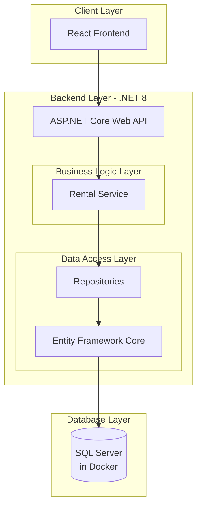
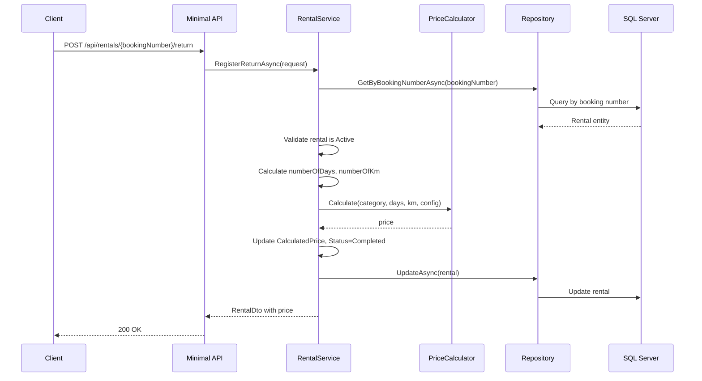
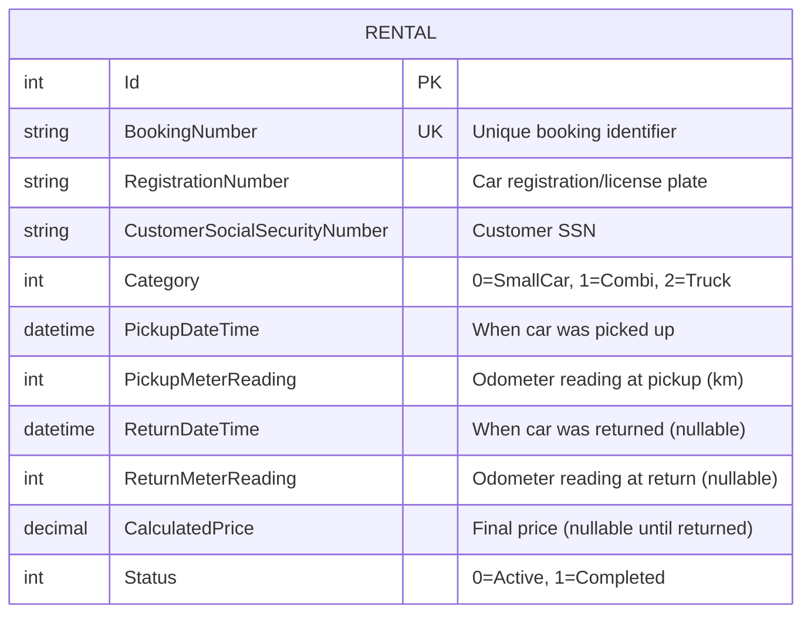
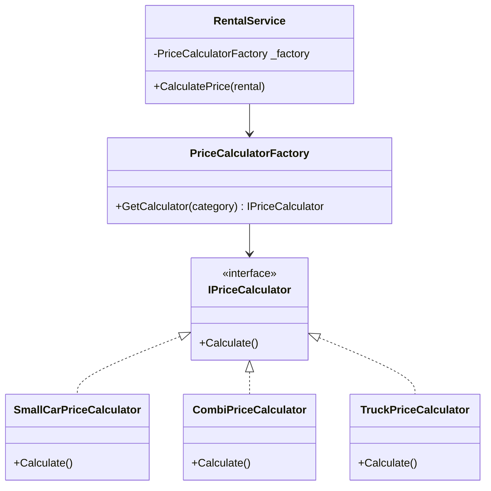

# Car Rental Service - Presentation

---

## Slide 1: Title

# Car Rental Service API

A robust and extensible rental service built with .NET 8 Minimal API, demonstrating best practices in software design and architecture.

---

## Slide 2: System Architecture

This diagram shows the overall architecture, including the frontend, backend, and database layers.

---

## Slide 3: Data Flow (Car Return)

This sequence diagram illustrates the process of returning a car and calculating the final price.

---

## Slide 4: Database Schema

The core of our system is a single `RENTAL` table designed to hold all necessary information for a rental lifecycle.

---

## Slide 5: Design Pattern: Strategy

To handle different pricing formulas for each car category, the **Strategy Pattern** was used. This makes the system extensible and easy to maintain.

- **Problem**: Different car types have unique pricing rules.
- **Solution**: Encapsulate each pricing algorithm into its own "strategy" class.
- **Benefit**: We can add new car categories and pricing rules without changing existing code.

---

## Slide 6: API Endpoints

The service exposes a clear set of RESTful endpoints for managing rentals.

| Method | Endpoint                              | Description                             |
| ------ | ------------------------------------- | --------------------------------------- |
| POST   | `/api/rentals/pickup`                 | Register car pickup                     |
| POST   | `/api/rentals/{bookingNumber}/return` | Register car return and calculate price |
| GET    | `/api/rentals`                        | Get all rentals                         |
| GET    | `/api/rentals/active`                 | Get active rentals only                 |
| GET    | `/api/rentals/{bookingNumber}`        | Get rental by booking number            |

---

## Slide 7: Summary

- **Clean Architecture**: A well-structured and maintainable codebase.
- **Extensible Design**: The Strategy Pattern allows for easy addition of new car categories and pricing models.
- **Complete Implementation**: All core requirements for the rental service have been met.
- **Modern Tech Stack**: Built using the latest .NET 8 features for high performance.

This concludes the presentation. Thank you.
