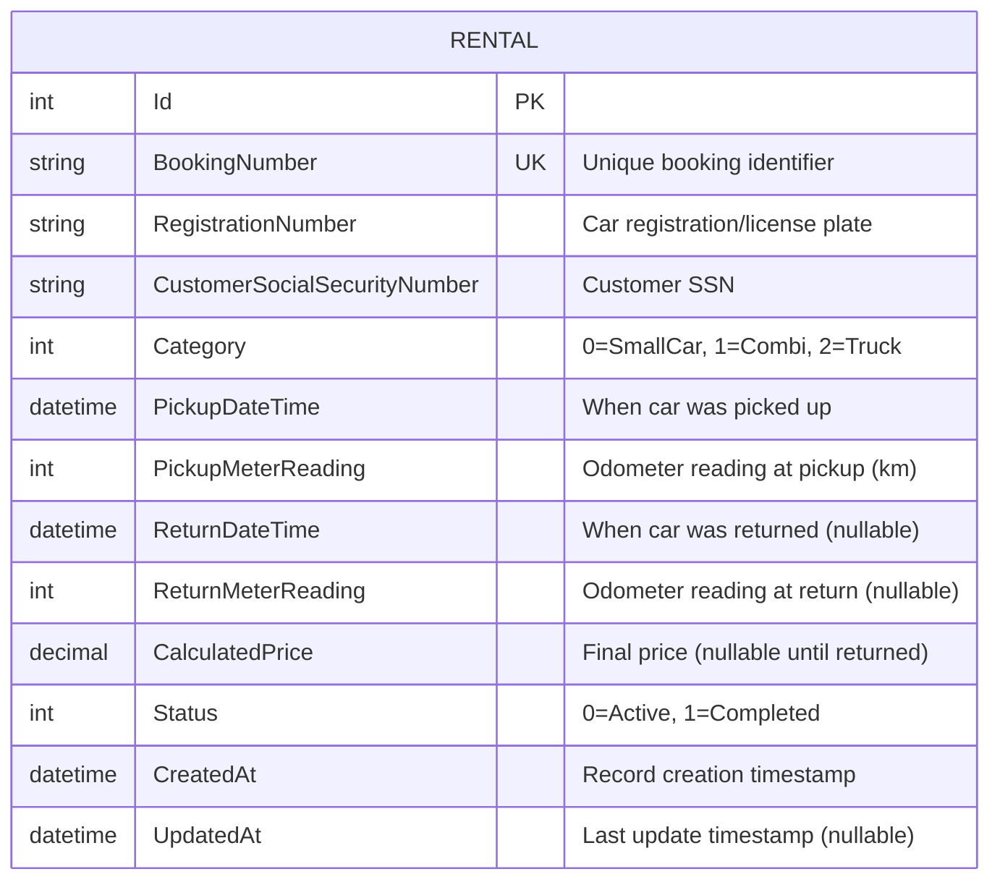
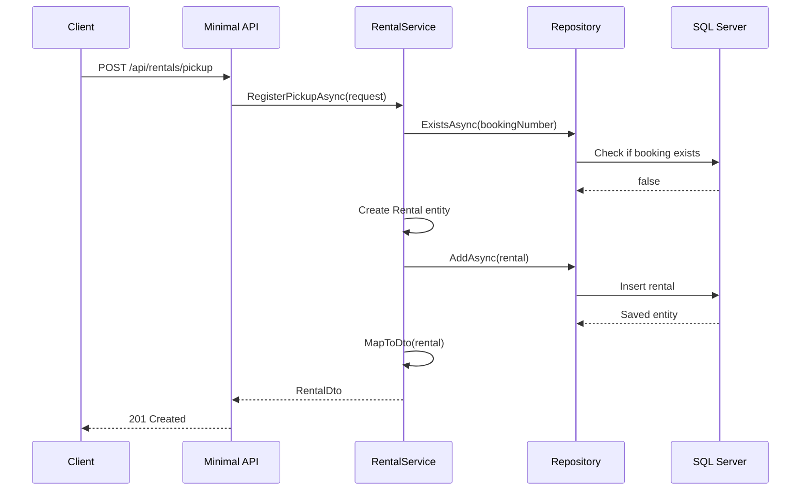
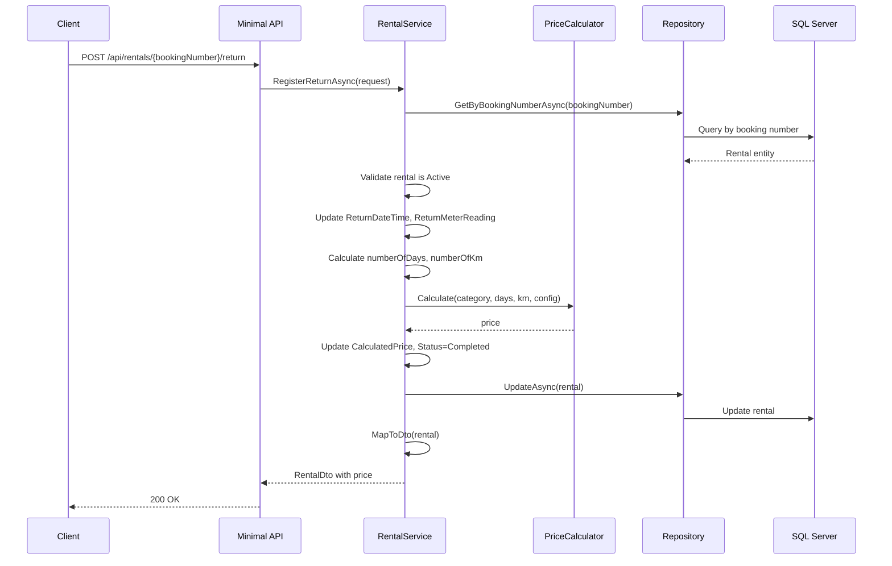

# Car Rental Service - Class Diagram & Design

## Requirements Summary

- **Car Categories**: Small car, Combi, Truck (extensible)
- **Use Cases**:
  1. Register car pickup
  2. Register car return with automatic price calculation
- **Architecture**: Minimal API, Repository Pattern, Single Table (Rental)
- **No Authentication/Authorization**

## Price Calculation Formulas

| Category  | Formula                                                               |
| --------- | --------------------------------------------------------------------- |
| Small car | `baseDayRental × numberOfDays`                                        |
| Combi     | `baseDayRental × numberOfDays × 1.3 + baseKmPrice × numberOfKm`       |
| Truck     | `baseDayRental × numberOfDays × 1.5 + baseKmPrice × numberOfKm × 1.5` |

---

## Class Diagram

```mermaid
classDiagram
    class Rental {
        +int Id
        +string BookingNumber
        +string RegistrationNumber
        +string CustomerSocialSecurityNumber
        +CarCategory Category
        +DateTime PickupDateTime
        +int PickupMeterReading
        +DateTime? ReturnDateTime
        +int? ReturnMeterReading
        +decimal? CalculatedPrice
        +RentalStatus Status
        +DateTime CreatedAt
        +DateTime? UpdatedAt
    }

    class CarCategory {
        <<enumeration>>
        SmallCar
        Combi
        Truck
    }

    class RentalStatus {
        <<enumeration>>
        Active
        Completed
    }

    class PickupRentalRequest {
        +string BookingNumber
        +string RegistrationNumber
        +string CustomerSocialSecurityNumber
        +CarCategory Category
        +DateTime PickupDateTime
        +int PickupMeterReading
    }

    class ReturnRentalRequest {
        +string BookingNumber
        +DateTime ReturnDateTime
        +int ReturnMeterReading
    }

    class RentalDto {
        +int Id
        +string BookingNumber
        +string RegistrationNumber
        +string CustomerSocialSecurityNumber
        +string Category
        +DateTime PickupDateTime
        +int PickupMeterReading
        +DateTime? ReturnDateTime
        +int? ReturnMeterReading
        +decimal? CalculatedPrice
        +string Status
        +int? NumberOfDays
        +int? NumberOfKm
    }

    class PriceCalculationConfig {
        +decimal BaseDayRental
        +decimal BaseKmPrice
    }

    class IRepository~T~ {
        <<interface>>
        +Task~T~ GetByIdAsync(int id)
        +Task~T~ GetByBookingNumberAsync(string bookingNumber)
        +Task~IEnumerable~T~~ GetAllAsync()
        +Task~T~ AddAsync(T entity)
        +Task UpdateAsync(T entity)
        +Task DeleteAsync(int id)
        +Task~bool~ ExistsAsync(Expression predicate)
    }

    class Repository~T~ {
        -RentalDbContext _context
        -DbSet~T~ _dbSet
        +Repository(RentalDbContext context)
        +Task~T~ GetByIdAsync(int id)
        +Task~T~ GetByBookingNumberAsync(string bookingNumber)
        +Task~IEnumerable~T~~ GetAllAsync()
        +Task~T~ AddAsync(T entity)
        +Task UpdateAsync(T entity)
        +Task DeleteAsync(int id)
        +Task~bool~ ExistsAsync(Expression predicate)
    }

    class IRentalService {
        <<interface>>
        +Task~RentalDto~ RegisterPickupAsync(PickupRentalRequest request)
        +Task~RentalDto~ RegisterReturnAsync(ReturnRentalRequest request)
        +Task~RentalDto~ GetRentalByBookingNumberAsync(string bookingNumber)
        +Task~IEnumerable~RentalDto~~ GetAllRentalsAsync()
        +Task~IEnumerable~RentalDto~~ GetActiveRentalsAsync()
    }

    class RentalService {
        -IRepository~Rental~ _repository
        -PriceCalculationConfig _priceConfig
        +RentalService(IRepository repository, IOptions config)
        +Task~RentalDto~ RegisterPickupAsync(PickupRentalRequest request)
        +Task~RentalDto~ RegisterReturnAsync(ReturnRentalRequest request)
        +Task~RentalDto~ GetRentalByBookingNumberAsync(string bookingNumber)
        +Task~IEnumerable~RentalDto~~ GetAllRentalsAsync()
        +Task~IEnumerable~RentalDto~~ GetActiveRentalsAsync()
        -decimal CalculatePrice(Rental rental)
        -RentalDto MapToDto(Rental rental)
    }

    class RentalDbContext {
        +DbSet~Rental~ Rentals
        +RentalDbContext(DbContextOptions options)
        #OnModelCreating(ModelBuilder modelBuilder)
    }

    class IPriceCalculator {
        <<interface>>
        +decimal Calculate(int numberOfDays, int numberOfKm, PriceCalculationConfig config)
        +CarCategory ApplicableCategory()
    }

    class SmallCarPriceCalculator {
        +decimal Calculate(int numberOfDays, int numberOfKm, PriceCalculationConfig config)
        +CarCategory ApplicableCategory()
    }

    class CombiPriceCalculator {
        +decimal Calculate(int numberOfDays, int numberOfKm, PriceCalculationConfig config)
        +CarCategory ApplicableCategory()
    }

    class TruckPriceCalculator {
        +decimal Calculate(int numberOfDays, int numberOfKm, PriceCalculationConfig config)
        +CarCategory ApplicableCategory()
    }

    class PriceCalculatorFactory {
        -Dictionary~CarCategory, IPriceCalculator~ _calculators
        +PriceCalculatorFactory(IEnumerable~IPriceCalculator~ calculators)
        +IPriceCalculator GetCalculator(CarCategory category)
    }

    Rental --> CarCategory
    Rental --> RentalStatus
    Repository~T~ ..|> IRepository~T~
    Repository~T~ --> RentalDbContext
    RentalService ..|> IRentalService
    RentalService --> IRepository~Rental~
    RentalService --> PriceCalculationConfig
    RentalService --> PriceCalculatorFactory
    RentalService ..> PickupRentalRequest
    RentalService ..> ReturnRentalRequest
    RentalService ..> RentalDto
    RentalDbContext --> Rental
    SmallCarPriceCalculator ..|> IPriceCalculator
    CombiPriceCalculator ..|> IPriceCalculator
    TruckPriceCalculator ..|> IPriceCalculator
    PriceCalculatorFactory --> IPriceCalculator
    IPriceCalculator ..> PriceCalculationConfig
```



---

## Database Schema



---

## Minimal API Endpoints

| Method | Endpoint                              | Description                             |
| ------ | ------------------------------------- | --------------------------------------- |
| POST   | `/api/rentals/pickup`                 | Register car pickup                     |
| POST   | `/api/rentals/{bookingNumber}/return` | Register car return and calculate price |
| GET    | `/api/rentals`                        | Get all rentals                         |
| GET    | `/api/rentals/active`                 | Get active rentals only                 |
| GET    | `/api/rentals/{bookingNumber}`        | Get rental by booking number            |

---

## Business Logic Flow

### Pickup Registration Flow



### Return Registration Flow



---

## Configuration

**appsettings.json**

```json
{
  "PriceCalculation": {
    "BaseDayRental": 100.0,
    "BaseKmPrice": 5.0
  },
  "ConnectionStrings": {
    "DefaultConnection": "Server=localhost,1433;Database=RentalDB;User Id=sa;Password=YourStrong@Password123;TrustServerCertificate=True;"
  }
}
```

---

## Strategy Pattern Implementation

### Why Strategy Pattern?

**Problem**: Three car categories with different pricing formulas
**Solution**: Strategy pattern encapsulates each pricing algorithm in separate classes

### Benefits:

1. **Open/Closed Principle**: Add new car categories without modifying existing code
2. **Single Responsibility**: Each calculator handles one pricing formula
3. **Testability**: Each pricing calculator can be unit tested independently
4. **Maintainability**: Clear separation of pricing logic

### Implementation:

```csharp
// IPriceCalculator.cs
public interface IPriceCalculator
{
    decimal Calculate(int numberOfDays, int numberOfKm, PriceCalculationConfig config);
    CarCategory ApplicableCategory { get; }
}

// SmallCarPriceCalculator.cs
public class SmallCarPriceCalculator : IPriceCalculator
{
    public CarCategory ApplicableCategory => CarCategory.SmallCar;

    public decimal Calculate(int numberOfDays, int numberOfKm, PriceCalculationConfig config)
    {
        return config.BaseDayRental * numberOfDays;
    }
}

// CombiPriceCalculator.cs
public class CombiPriceCalculator : IPriceCalculator
{
    public CarCategory ApplicableCategory => CarCategory.Combi;

    public decimal Calculate(int numberOfDays, int numberOfKm, PriceCalculationConfig config)
    {
        return config.BaseDayRental * numberOfDays * 1.3m + config.BaseKmPrice * numberOfKm;
    }
}

// TruckPriceCalculator.cs
public class TruckPriceCalculator : IPriceCalculator
{
    public CarCategory ApplicableCategory => CarCategory.Truck;

    public decimal Calculate(int numberOfDays, int numberOfKm, PriceCalculationConfig config)
    {
        return config.BaseDayRental * numberOfDays * 1.5m + config.BaseKmPrice * numberOfKm * 1.5m;
    }
}

// PriceCalculatorFactory.cs
public class PriceCalculatorFactory
{
    private readonly Dictionary<CarCategory, IPriceCalculator> _calculators;

    public PriceCalculatorFactory(IEnumerable<IPriceCalculator> calculators)
    {
        _calculators = calculators.ToDictionary(c => c.ApplicableCategory);
    }

    public IPriceCalculator GetCalculator(CarCategory category)
    {
        if (_calculators.TryGetValue(category, out var calculator))
            return calculator;

        throw new InvalidOperationException($"No price calculator found for category: {category}");
    }
}

// Usage in RentalService
private decimal CalculatePrice(Rental rental)
{
    var days = (int)Math.Ceiling((rental.ReturnDateTime!.Value - rental.PickupDateTime).TotalDays);
    var km = rental.ReturnMeterReading!.Value - rental.PickupMeterReading;

    var calculator = _priceCalculatorFactory.GetCalculator(rental.Category);
    return calculator.Calculate(days, km, _priceConfig);
}
```

### Dependency Injection Setup:

```csharp
// Program.cs
builder.Services.AddScoped<IPriceCalculator, SmallCarPriceCalculator>();
builder.Services.AddScoped<IPriceCalculator, CombiPriceCalculator>();
builder.Services.AddScoped<IPriceCalculator, TruckPriceCalculator>();
builder.Services.AddSingleton<PriceCalculatorFactory>();
```

---

## Assumptions & Design Decisions

1. **BookingNumber**: Unique identifier generated by client/reservation system
2. **baseDayRental & baseKmPrice**: Configured in appsettings.json (could be per-rental in future)
3. **Price Calculation Timing**: Only calculated when car is returned
4. **numberOfDays**: Calculated as `(ReturnDateTime - PickupDateTime).TotalDays` rounded up (using `Math.Ceiling`)
5. **numberOfKm**: `ReturnMeterReading - PickupMeterReading`
6. **Validation**:
   - BookingNumber must be unique
   - Return meter reading must be >= pickup meter reading
   - Can only return Active rentals
   - Return date must be >= pickup date
7. **Status**: Active (picked up but not returned), Completed (returned with price calculated)
8. **Extensibility**: New car categories added by:
   - Add to `CarCategory` enum
   - Create new `IPriceCalculator` implementation in `Pricing/` folder
   - Register in DI container
   - **No changes to existing code required!**

---

## Technology Stack

- **Framework**: .NET 8 Minimal API
- **ORM**: Entity Framework Core 8
- **Database**: SQL Server 2022 (Docker)
- **Patterns**: Repository Pattern, Service Layer
- **Documentation**: Swagger/OpenAPI
